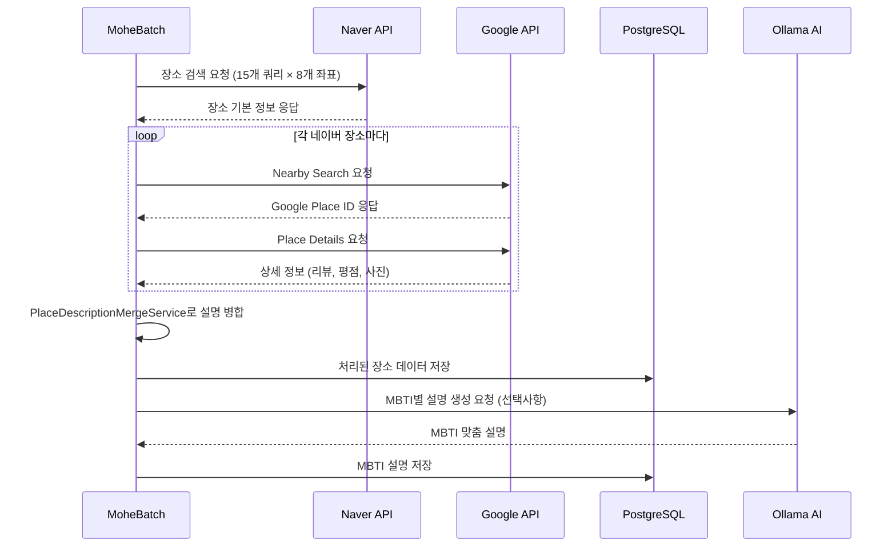
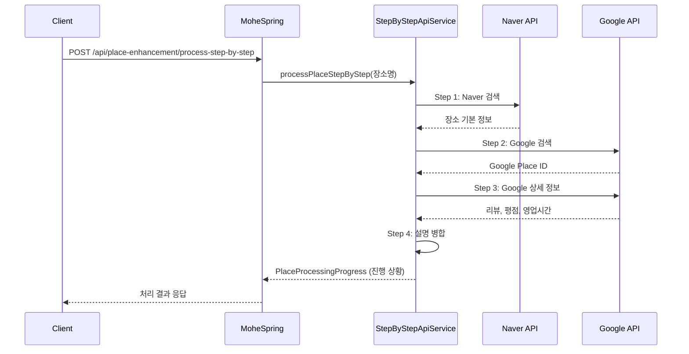

# Mohe 장소 정보 향상 시스템 종합 가이드

## 개요

이 문서는 Mohe 프로젝트의 장소 정보 수집, 병합, 및 향상 시스템에 대한 종합적인 가이드입니다. 이 시스템은 네이버와 구글 API를 통해 장소 데이터를 수집하고, 독창적이고 매력적인 설명을 생성하여 사용자에게 고품질의 장소 정보를 제공합니다.

## 시스템 아키텍처

### 전체 구조도

```
┌─────────────────┐    ┌─────────────────┐    ┌─────────────────┐
│   MoheReact     │    │   MoheSpring    │    │   MoheBatch     │
│   (Frontend)    │◄──►│   (Backend)     │◄──►│   (배치처리)    │
└─────────────────┘    └─────────────────┘    └─────────────────┘
                                │
                                ▼
                       ┌─────────────────┐
                       │  PostgreSQL DB  │
                       │   + pgvector    │
                       └─────────────────┘
                                ▲
                       ┌─────────────────┐
                       │  External APIs  │
                       │ • Naver Places  │
                       │ • Google Places │
                       │ • Ollama AI     │
                       └─────────────────┘
```

### 컴포넌트 간 상호작용

1. **MoheBatch**: 외부 API를 통해 장소 데이터 수집 및 1차 처리
2. **MoheSpring**: 실시간 API 처리, 설명 병합, 사용자 요청 처리
3. **MoheReact**: 사용자 인터페이스 제공
4. **PostgreSQL**: 모든 장소 데이터 및 처리 결과 저장

## 주요 기능

### 1. 단계별 API 호출 관리

기존의 배치 방식과 달리, 개별 장소에 대해 단계별로 API를 호출하고 진행 상황을 추적할 수 있습니다.

#### 처리 단계
1. **Naver Search**: 네이버 장소 검색 API 호출
2. **Google Search**: 구글 장소 검색 API 호출  
3. **Google Details**: 구글 장소 상세 정보 API 호출
4. **Description Merge**: 수집된 데이터를 병합하여 고품질 설명 생성

#### API 엔드포인트
```http
POST /api/place-enhancement/process-step-by-step
Parameters:
- placeName (required): 장소명
- address (optional): 주소
- latitude (optional): 위도
- longitude (optional): 경도
```

### 2. 지능형 설명 병합 시스템

`PlaceDescriptionMergeService`는 네이버와 구글 데이터를 분석하여 5가지 스타일의 독창적인 설명을 생성합니다.

#### 설명 생성 스타일

##### FOOD_FOCUSED (음식 중심)
- 대상: 음식점, 레스토랑, 카페
- 특징: 메뉴, 맛, 인기 음식에 집중
- 예시: \"이곳은 특제 파스타로 유명하며, 특히 크림 소스 요리가 인기입니다.\"

##### ATMOSPHERE_DRIVEN (분위기 중심)
- 대상: 카페, 문화공간
- 특징: 인테리어, 분위기, 공간 특성 강조
- 예시: \"아늑한 분위기의 특별한 공간으로, 차분한 시간을 보낼 수 있습니다.\"

##### REVIEW_BASED (리뷰 기반)
- 대상: 구글 리뷰가 풍부한 장소
- 특징: 실제 방문자 경험 중심
- 예시: \"방문객들이 특히 좋아하는 이유는 친절한 서비스, 깨끗한 시설 때문입니다.\"

##### MINIMAL_CHIC (미니멀 시크)
- 대상: 박물관, 갤러리, 문화시설
- 특징: 간결하고 세련된 표현
- 예시: \"이곳에서는 현대 미술 전시를 관람할 수 있습니다.\"

##### BALANCED (균형잡힌)
- 대상: 모든 장소
- 특징: 다양한 정보를 균형있게 제공
- 예시: 기본적인 정보와 평가를 종합한 설명

### 3. 모듈화된 API 제공자 시스템

`ApiProviderRegistry`를 통해 새로운 API를 플러그인 방식으로 쉽게 추가할 수 있습니다.

#### 현재 지원 API
- **Naver Local Search API**: 기본 장소 정보, 카테고리, 주소
- **Google Places API**: 평점, 리뷰, 영업시간, 사진

#### 미래 확장 가능 API
- Kakao Map API
- Foursquare API
- 자체 크롤링 데이터
- 사용자 생성 콘텐츠

## 데이터베이스 스키마

### 핵심 테이블

#### places (장소 정보)
```sql
-- 정리된 핵심 컬럼들
id BIGSERIAL PRIMARY KEY,
name TEXT NOT NULL,                          -- 장소명
address TEXT,                                -- 기본 주소
road_address TEXT,                           -- 도로명 주소
latitude NUMERIC(10,8),                      -- 위도
longitude NUMERIC(11,8),                     -- 경도
category TEXT,                               -- 카테고리
description TEXT,                            -- 원본 설명
merged_description TEXT,                     -- 병합된 고품질 설명
description_style VARCHAR(50),               -- 설명 스타일
description_source_info JSONB,               -- 설명 메타데이터
rating NUMERIC(3,2),                         -- 평점
review_count INTEGER,                        -- 리뷰 수
images TEXT[],                               -- 이미지 URL 배열
tags TEXT[],                                 -- 태그 배열
naver_place_id VARCHAR(100),                 -- 네이버 장소 ID
google_place_id VARCHAR(255),                -- 구글 장소 ID
phone VARCHAR(50),                           -- 전화번호
website_url VARCHAR(500),                    -- 웹사이트
opening_hours JSONB,                         -- 영업시간 (구조화된 데이터)
types TEXT[],                                -- 구글 장소 타입
price_level SMALLINT,                        -- 가격 수준
source_flags JSONB,                          -- 데이터 소스 플래그
created_at TIMESTAMPTZ,                      -- 생성시간
updated_at TIMESTAMPTZ,                      -- 수정시간
last_description_update TIMESTAMPTZ          -- 설명 마지막 업데이트
```

#### 제거된 불필요한 컬럼들
- `title` (name과 중복)
- `location` (address와 중복)  
- `altitude` (서울 지역에서 불필요)
- `additional_image_count` (images 배열 길이로 대체)
- `transportation_car_time`, `transportation_bus_time` (실시간 조회로 대체)
- `weather_tags`, `noise_tags` (사용되지 않음)
- `operating_hours` (opening_hours JSONB로 대체)

### 관련 테이블

#### place_external_raw (외부 API 원본 데이터)
- 네이버/구글 API 응답 원본 저장
- 디버깅 및 데이터 감사용

#### place_mbti_descriptions (MBTI별 설명)
- 16가지 MBTI 유형별 맞춤 설명 저장
- Ollama AI로 생성

#### place_similarity, place_similarity_topk (유사도 매트릭스)
- 장소 간 유사도 계산 결과
- 추천 시스템용 데이터

## API 요청/응답 플로우

### 1. 배치 처리 플로우 (MoheBatch)



### 2. 실시간 처리 플로우 (MoheSpring)



## 개발자 가이드

### 설치 및 설정

#### 1. 환경 변수 설정 (.env 파일)
```env
# 네이버 API
NAVER_CLIENT_ID=your_naver_client_id
NAVER_CLIENT_SECRET=your_naver_client_secret

# 구글 API  
GOOGLE_PLACES_API_KEY=your_google_api_key

# Ollama AI (선택사항)
OLLAMA_HOST=http://localhost:11434

# 데이터베이스
DATABASE_URL=jdbc:postgresql://localhost:5432/mohe_db
DATABASE_USERNAME=mohe_user
DATABASE_PASSWORD=mohe_password

# 추천 시스템 가중치 조정
MOHE_WEIGHT_JACCARD=0.7
MOHE_WEIGHT_COSINE=0.3
MOHE_WEIGHT_SAME_MBTI=2.0
```

#### 2. 데이터베이스 마이그레이션
```bash
# 스키마 정리 및 새로운 기능 적용
./gradlew flywayMigrate

# 또는 Docker 환경에서
docker-compose up postgres
docker-compose run mohe-backend gradle flywayMigrate
```

### 새로운 API 제공자 추가하기

#### 1. ApiProvider 인터페이스 구현
```kotlin
class KakaoApiProvider : ApiProvider {
    override fun getProviderName(): String = \"kakao\"
    
    override fun getSupportedDataTypes(): Set<String> = 
        setOf(\"description\", \"category\", \"address\", \"photos\")
    
    override suspend fun fetchPlaceData(placeName: String, address: String?): Any {
        // Kakao Map API 호출 로직 구현
        return kakaoPlaceData
    }
    
    override fun validateConfiguration(): Boolean {
        // API 키 유효성 검증
        return !kakaoApiKey.isNullOrBlank()
    }
}
```

#### 2. 등록 및 사용
```kotlin
@Configuration
class ApiProviderConfig {
    
    @Bean
    fun registerKakaoProvider(registry: ApiProviderRegistry): ApiProviderRegistry {
        registry.registerProvider(\"kakao\", KakaoApiProvider())
        return registry
    }
}
```

### 새로운 설명 생성 전략 추가하기

#### 1. PlaceProcessingStrategy 인터페이스 구현
```kotlin
class LocalFocusedStrategy : PlaceProcessingStrategy {
    override fun getStrategyName(): String = \"local_focused\"
    
    override fun mergeResults(providerData: Map<String, Any>): PlaceMergeResult {
        // 현지인 추천 중심의 설명 생성 로직
        val mergedData = MergedPlaceData(
            name = extractName(providerData),
            description = buildLocalDescription(providerData),
            // ... 기타 필드
        )
        return PlaceMergeResult.success(mergedData, providerData.keys, \"local_focused\")
    }
    
    override fun isApplicableFor(placeCategory: String, providerData: Map<String, Any>): Boolean {
        // 현지 맛집, 숨은 명소 등에 적용
        return placeCategory.contains(\"현지\") || hasLocalRecommendations(providerData)
    }
}
```

## 데이터베이스 관리

### 데이터베이스 리셋 기능

시스템에는 개발 및 테스트를 위한 안전한 데이터베이스 리셋 기능이 포함되어 있습니다.

#### 사용 가능한 함수들

##### 1. 전체 장소 데이터 리셋
```sql
-- 모든 장소 관련 데이터 삭제 (사용자 데이터 포함)
SELECT reset_all_place_data(true); -- 백업 생성 후 리셋
```

##### 2. 장소 데이터만 리셋 (사용자 데이터 보존)
```sql
-- 사용자, 북마크 관계는 유지하고 장소 데이터만 리셋
SELECT reset_places_only(true);
```

##### 3. 개별 테이블 리셋
```sql
-- 특정 테이블만 리셋
SELECT reset_table_data('places', true);
```

##### 4. 백업 정리
```sql
-- 7일 이상된 백업 테이블 삭제
SELECT cleanup_old_backups(7);
```

#### 안전 장치
- **프로덕션 환경 보호**: `system_settings` 테이블의 `environment` 값이 'production'인 경우 리셋 불가
- **자동 백업**: 리셋 전 자동으로 백업 테이블 생성
- **외래키 처리**: 임시로 외래키 제약조건을 비활성화하여 안전한 삭제 보장

### 성능 최적화

#### 인덱스 전략
```sql
-- 검색 성능 향상을 위한 인덱스
CREATE INDEX CONCURRENTLY idx_places_category_rating ON places(category, rating DESC);
CREATE INDEX CONCURRENTLY idx_places_description_style ON places(description_style);
CREATE INDEX CONCURRENTLY idx_places_last_description_update ON places(last_description_update);

-- 지리적 검색을 위한 인덱스  
CREATE INDEX CONCURRENTLY idx_places_location ON places USING GIST(ll_to_earth(latitude::float8, longitude::float8));
```

#### 배치 처리 최적화
```yaml
# application.yml
spring:
  batch:
    chunk-size: 50              # 한 번에 처리할 아이템 수
    reader-pool-size: 3         # 병렬 읽기 스레드 수
    writer-pool-size: 2         # 병렬 쓰기 스레드 수
    
app:
  external:
    naver:
      page-size: 5              # 네이버 API 페이지 크기
      max-pages: 100            # 최대 페이지 수
      timeout: 10               # 타임아웃 (초)
    google:
      timeout: 15               # 구글 API 타임아웃 (초)
      search-radius: 100        # 검색 반경 (미터)
```

## 모니터링 및 로깅

### 주요 메트릭스

#### API 호출 관련
- `naver_api_calls_total`: 네이버 API 호출 횟수
- `google_api_calls_total`: 구글 API 호출 횟수  
- `api_call_duration_seconds`: API 호출 응답 시간
- `api_call_failures_total`: API 호출 실패 횟수

#### 설명 생성 관련
- `description_generation_success_total{style}`: 설명 생성 성공 (스타일별)
- `description_generation_failed_total`: 설명 생성 실패
- `description_merge_duration_seconds`: 설명 병합 처리 시간

#### 배치 처리 관련
- `places_processed_total`: 처리된 장소 수
- `places_enriched_total`: 성공적으로 강화된 장소 수
- `batch_processing_duration_seconds`: 배치 처리 시간

### 로그 설정

```yaml
# logback-spring.xml 주요 설정
logging:
  level:
    com.mohe.spring.service.PlaceDescriptionMergeService: DEBUG
    com.mohe.spring.service.StepByStepApiService: INFO
    com.example.ingestion: INFO
    org.springframework.batch: INFO
  pattern:
    console: \"%d{yyyy-MM-dd HH:mm:ss} [%thread] %-5level [%X{correlationId}] %logger{36} - %msg%n\"
    file: \"%d{yyyy-MM-dd HH:mm:ss} [%thread] %-5level [%X{correlationId}] %logger{36} - %msg%n\"
```

### 알림 및 경고

#### 중요 알림 조건
- API 호출 실패율 > 10%
- 설명 생성 실패율 > 5%  
- 배치 처리 시간 > 30분
- 데이터베이스 연결 실패

#### Prometheus 알림 규칙 예시
```yaml
groups:
  - name: mohe-place-enhancement
    rules:
      - alert: HighAPIFailureRate
        expr: rate(api_call_failures_total[5m]) > 0.1
        for: 2m
        annotations:
          summary: \"API 호출 실패율이 높습니다\"
          description: \"{{ $labels.provider }} API 실패율이 {{ $value }}입니다\"
          
      - alert: SlowDescriptionGeneration
        expr: rate(description_merge_duration_seconds[5m]) > 5
        for: 1m
        annotations:
          summary: \"설명 생성이 느려지고 있습니다\"
          description: \"설명 병합 평균 처리 시간: {{ $value }}초\"
```

## 문제해결 가이드

### 일반적인 문제들

#### 1. API 호출 실패
**증상**: 네이버/구글 API 호출이 계속 실패
**해결방법**:
1. API 키 유효성 확인
2. API 할당량 확인
3. 네트워크 연결 상태 확인
4. 요청 형식 검증

```bash
# API 키 테스트
curl -H \"X-Naver-Client-Id: YOUR_ID\" \
     -H \"X-Naver-Client-Secret: YOUR_SECRET\" \
     \"https://openapi.naver.com/v1/search/local.json?query=카페\"
```

#### 2. 설명 생성 품질 문제  
**증상**: 생성된 설명이 일률적이거나 품질이 낮음
**해결방법**:
1. 설명 스타일 로직 검토
2. 입력 데이터 품질 확인
3. 키워드 추출 로직 개선
4. 템플릿 다양성 증가

#### 3. 배치 처리 성능 저하
**증상**: 배치 처리가 너무 오래 걸림
**해결방법**:
1. 청크 사이즈 조정
2. 병렬 처리 스레드 수 증가
3. 데이터베이스 인덱스 최적화
4. API 호출 간격 조정

#### 4. 데이터베이스 용량 증가
**증상**: 데이터베이스 크기가 급격히 증가
**해결방법**:
1. 오래된 백업 테이블 정리
2. 중복 데이터 제거
3. 불필요한 외부 API 원본 데이터 삭제
4. 압축 설정 적용

```sql
-- 용량 분석
SELECT 
    schemaname,
    tablename,
    pg_size_pretty(pg_total_relation_size(schemaname||'.'||tablename)) as size
FROM pg_tables 
WHERE schemaname = 'public'
ORDER BY pg_total_relation_size(schemaname||'.'||tablename) DESC;
```

## 향후 개발 계획

### Phase 1: 현재 구현 완료
- ✅ 기본 네이버/구글 API 통합
- ✅ 단계별 API 호출 관리
- ✅ 지능형 설명 병합 시스템
- ✅ 데이터베이스 스키마 최적화
- ✅ 리셋 및 백업 메커니즘

### Phase 2: 확장 계획 (Q2 2024)
- [ ] Kakao Map API 통합
- [ ] 실시간 장소 정보 업데이트
- [ ] 사용자 피드백 기반 설명 개선
- [ ] A/B 테스트 시스템 구축

### Phase 3: AI 고도화 (Q3 2024)  
- [ ] GPT/Claude API를 활용한 고급 설명 생성
- [ ] 이미지 분석 기반 분위기 태깅
- [ ] 개인화된 설명 생성
- [ ] 실시간 트렌드 반영

### Phase 4: 확장성 강화 (Q4 2024)
- [ ] 마이크로서비스 아키텍처로 전환
- [ ] 캐싱 레이어 구축 (Redis)
- [ ] CDN을 통한 이미지 최적화
- [ ] 글로벌 확장을 위한 다국어 지원

---

## 연락처 및 지원

이 시스템에 대한 질문이나 개선 제안이 있으시면 다음을 통해 연락해주세요:

- 개발팀 이슈 트래킹: [GitHub Issues](https://github.com/your-org/mohe/issues)
- 기술 문의: tech@mohe.com
- 시스템 장애 신고: ops@mohe.com

---

*이 문서는 Mohe 장소 정보 향상 시스템 v2.0을 기준으로 작성되었습니다.*
*마지막 업데이트: 2024년 1월*